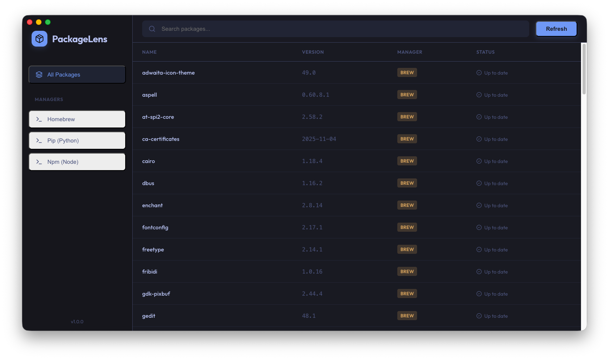
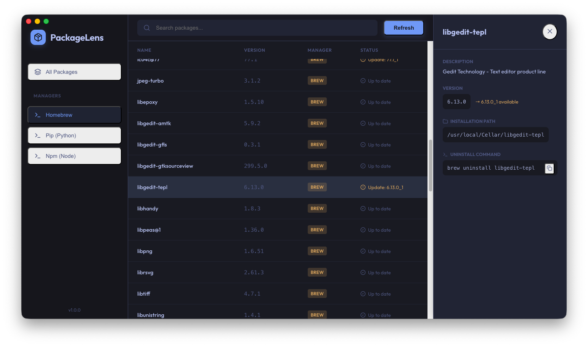

# PackageLens

**PackageLens** is a unified macOS utility that aggregates, displays, and manages installed software packages from Homebrew, Pip, and Npm. It provides a clean, modern interface to view installed versions, check for updates, and get uninstallation commands without switching between multiple terminal windows.




## Features

- **Multi-Manager Support**: Seamlessly view packages from Homebrew, Pip (Python), and Npm (Node.js).
- **Unified Dashboard**: A single, searchable list for all your development tools.
- **Update Detection**: Instantly see which packages have updates available.
- **Detailed Insights**: View installation paths, versions, and descriptions.
- **Uninstall Helper**: One-click copy for uninstallation commands.

## Tech Stack

- **Electron**: For the native desktop experience.
- **React + Vite**: For a fast, responsive user interface.
- **TypeScript**: For type-safe, robust code.
- **Vanilla CSS**: For a custom, lightweight, and beautiful design system.

## Installation

1. Clone the repository:
   ```bash
   git clone https://github.com/yourusername/package-lens.git
   ```
2. Install dependencies:
   ```bash
   npm install
   ```
3. Run in development mode:
   ```bash
   npm run dev
   ```
4. Build for production:
   ```bash
   npm run build
   ```

## Credits

Created by **Sachin Acharya** using **Antigravity**.

[](https://www.linkedin.com/in/acharyasachin/)

---
*Generated with ❤️ by Antigravity*
